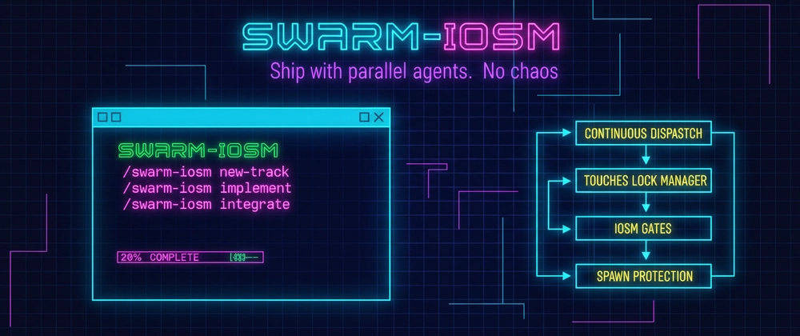

<p align="center">
  
</p>

<h1 align="center">Swarm-IOSM</h1>

<p align="center">
  <strong>Parallel Orchestration Engine for Claude Code with Built-in Quality Gates</strong>
</p>

<p align="center">
  <a href="https://claude.ai/code"></a>
  <a href="https://github.com/rokoss21/IOSM"></a>
  <a href="#"></a>
  <a href="LICENSE"></a>
</p>

<p align="center">
  <a href="#-key-features">Features</a> •
  <a href="#-quick-start">Quick Start</a> •
  <a href="#-architecture">Architecture</a> •
  <a href="#-documentation">Documentation</a> •
  <a href="#-use-cases">Use Cases</a> •
  <a href="#-contributing">Contributing</a>
</p>

---

## 🎯 What is Swarm-IOSM?

**Swarm-IOSM** is an advanced orchestration engine for [Claude Code](https://claude.ai/code) that transforms complex development tasks into coordinated parallel work streams with enforced quality standards.

It implements the [**IOSM methodology**](https://github.com/rokoss21/IOSM) (Improve → Optimize → Shrink → Modularize) as an executable system for parallel AI agent coordination, combining:

- 🤖 **Intelligent Orchestration** — Continuous dispatch scheduling with dependency analysis
- 🔒 **File Conflict Detection** — Lock management prevents parallel write conflicts
- 📋 **PRD-Driven Planning** — Structured requirements → decomposition → execution
- ✅ **IOSM Quality Gates** — Automated code quality, performance, and modularity checks
- 🔄 **Auto-Spawn Protocol** — Dynamic task discovery and creation during execution
- 📊 **Cost Tracking** — Real-time API cost monitoring with budget controls

### Why Swarm-IOSM?

Traditional development workflows struggle with:
- **Sequential bottlenecks** — One task blocks the next, wasting time
- **Context loss** — Large features lack structured documentation
- **Quality debt** — No systematic enforcement of engineering standards
- **Manual coordination** — Developers spend time orchestrating instead of building

Swarm-IOSM solves these by:
- **Parallelizing** independent work streams (commonly 3–8x faster than sequential)
- **Enforcing** IOSM quality gates before merge
- **Automating** task decomposition and subagent coordination
- **Tracking** all decisions and artifacts for full traceability

---

## ⚡ 60-Second Demo

```bash
# Install
git clone https://github.com/rokoss21/swarm-iosm.git .claude/skills/swarm-iosm

# In Claude Code
/swarm-iosm setup
/swarm-iosm new-track "Add JWT authentication"
```

**What you get:**
- `swarm/tracks/<id>/PRD.md` — Requirements document
- `swarm/tracks/<id>/plan.md` — Task breakdown with dependencies
- `swarm/tracks/<id>/reports/` — Subagent execution reports (after `/swarm-iosm implement`)

**See full example:** [`examples/demo-track/`](examples/demo-track/)

---

## 🌟 Key Features

### Core Capabilities

| Feature | Description | Benefits |
|---------|-------------|----------|
| **Continuous Dispatch Loop** | Tasks launch immediately when dependencies are met | No artificial wave barriers, maximum parallelism |
| **Parallel Subagent Execution** | Up to 8 simultaneous background/foreground agents | Often 3-8x faster than sequential execution |
| **IOSM Quality Gates** | Automated checks for code quality, performance, complexity | Quality-gated before merge |
| **File Lock Management** | Hierarchical conflict detection (file/folder) | Safe parallel writes, prevents merge conflicts |
| **Auto-Spawn from Discoveries** | Subagents report new work → orchestrator schedules | Self-organizing workflow adaptation |
| **Intelligent Error Recovery** | Pattern-based diagnosis with suggested fixes | Auto-diagnosis with 3 retry limit |
| **Cost & Budget Control** | Real-time token tracking, $10 default limit | Predictable API costs |
| **Checkpoint & Resume** | Crash recovery from last known state | Fault-tolerant long-running tasks |

### Feature Status

| Feature | Status | Command/Location |
|---------|--------|------------------|
| ✅ **Inter-Agent Communication** | Available in v2.0+ | `shared_context.md` auto-updated |
| ✅ **Task Dependency Visualization** | Available in v2.0+ | `--graph` flag in orchestration planner |
| ✅ **Anti-Pattern Detection** | Available in v2.0+ | Auto-warns during planning |
| ✅ **Template Customization** | Available in v2.0+ | Override in `swarm/templates/` |
| ✅ **Simulation Mode** | Available in v1.3+ | `/swarm-iosm simulate` |
| ✅ **Checkpoint & Resume** | Available in v1.3+ | `/swarm-iosm resume` |
| 🧪 **Live Monitoring** | Experimental | `/swarm-iosm watch` (basic implementation) |
| 🗺️ **IDE Integration** | Roadmap | VS Code extension planned |
| 🗺️ **CI/CD Templates** | Roadmap | GitHub Actions / GitLab CI examples |

---

## 🏗️ Architecture

### System Overview

```
┌──────────────────────────────────────────────────────────────────────┐
│                    ORCHESTRATOR (Main Claude Agent)                  │
│  ┌─────────────────────────────────────────────────────────────────┐ │
│  │              Continuous Dispatch Loop (v1.1+)                   │ │
│  │  ┌──────────┐  ┌──────────┐  ┌──────────┐  ┌──────────────────┐ │ │
│  │  │ Collect  │→ │ Classify │→ │ Conflict │→ │ Dispatch Batch   │ │ │
│  │  │  Ready   │  │  Modes   │  │  Check   │  │ (max 3-6 tasks)  │ │ │
│  │  └──────────┘  └──────────┘  └──────────┘  └──────────────────┘ │ │
│  │       ↑                                           │             │ │
│  │       │        ┌──────────┐  ┌──────────┐         ↓             │ │
│  │       └────────│  IOSM    │←─│ Auto-    │←────────┘             │ │
│  │                │  Gates   │  │ Spawn    │                       │ │
│  │                └──────────┘  └──────────┘                       │ │
│  └─────────────────────────────────────────────────────────────────┘ │
│                                   │                                  │
│               ┌───────────────────┼───────────────────┐              │
│               ↓                   ↓                   ↓              │
│  ┌────────────────────┐ ┌────────────────────┐ ┌─────────────────┐   │
│  │   Subagent (BG)    │ │   Subagent (BG)    │ │  Subagent (FG)  │   │
│  │   Explorer         │ │   Implementer-A    │ │  Architect      │   │
│  │   read-only        │ │   write-local      │ │  needs_user     │   │
│  └────────────────────┘ └────────────────────┘ └─────────────────┘   │
│               │                   │                   │              │
│               ↓                   ↓                   ↓              │
│         reports/T01.md      reports/T02.md      reports/T03.md       │
│         + SpawnCandidates   + SpawnCandidates   + Escalations        │
└──────────────────────────────────────────────────────────────────────┘
```

### IOSM Framework Integration

```
┌────────────────────────────────────────────────────────────────────────────┐
│                           IOSM FRAMEWORK                                   │
│                   https://github.com/rokoss21/IOSM                         │
├────────────────────────────────────────────────────────────────────────────┤
│                                                                            │
│    ┌──────────┐    ┌──────────┐    ┌──────────┐    ┌──────────────────┐    │
│    │ IMPROVE  │ →  │ OPTIMIZE │ →  │  SHRINK  │ →  │   MODULARIZE     │    │
│    │          │    │          │    │          │    │                  │    │
│    │ Clarity  │    │ Speed    │    │ Simplify │    │ Decompose        │    │
│    │ No dups  │    │ Resil.   │    │ Surface  │    │ Contracts        │    │
│    │ Invars   │    │ Chaos    │    │ Deps     │    │ Coupling         │    │
│    └────┬─────┘    └────┬─────┘    └────┬─────┘    └────────┬─────────┘    │
│         │               │               │                   │              │
│    ┌────▼─────┐    ┌────▼─────┐    ┌────▼─────┐    ┌────────▼─────────┐    │
│    │ Gate-I   │    │ Gate-O   │    │ Gate-S   │    │     Gate-M       │    │
│    │ ≥0.85    │    │ ≥0.75    │    │ ≥0.80    │    │     ≥0.80        │    │
│    └──────────┘    └──────────┘    └──────────┘    └──────────────────┘    │
│                                                                            │
│    IOSM-Index = (Gate-I + Gate-O + Gate-S + Gate-M) / 4                    │
│    Production threshold: ≥ 0.80                                            │
└────────────────────────────────────────────────────────────────────────────┘
```

### Task State Machine

```
┌──────────┐
│ backlog  │  All known tasks
└────┬─────┘
     │ dependencies satisfied
     ↓
┌──────────┐
│  ready   │  Eligible for dispatch
└────┬─────┘
     │ no file conflicts
     ├─────────────────┬─────────────────┐
     ↓                 ↓                 ↓
┌──────────┐    ┌──────────────┐   ┌──────────────────┐
│ running  │    │ blocked_user │   │ blocked_conflict │
│(BG or FG)│    │needs decision│   │ file lock held   │
└────┬─────┘    └──────────────┘   └──────────────────┘
     │ completes                          │ lock released
     ↓                                    ↓
┌──────────┐                         ┌──────────┐
│   done   │←────────────────────────│  ready   │
└──────────┘                         └──────────┘
     │ spawn candidates
     ↓
┌──────────┐
│ backlog  │  (auto-spawned tasks)
└──────────┘
```

---

## 🚀 Quick Start

### Installation

**Option 1: Project-Level** (Recommended)
```bash
git clone https://github.com/rokoss21/swarm-iosm.git .claude/skills/swarm-iosm
```

**Option 2: User-Level** (All Projects)
```bash
git clone https://github.com/rokoss21/swarm-iosm.git ~/.claude/skills/swarm-iosm
```

**Verify Installation:**
```bash
# In Claude Code
/swarm-iosm
```

### 5-Minute Tutorial

#### 1. Initialize Project Context
```
/swarm-iosm setup
```
Creates `swarm/` directory with project metadata.

#### 2. Create a Track
```
/swarm-iosm new-track "Add JWT authentication to API"
```
Claude will:
- Ask requirements questions (mode, priorities, constraints)
- Generate PRD (`swarm/tracks/<id>/PRD.md`)
- Decompose into tasks (`plan.md`)
- Assign subagent roles

#### 3. Validate Plan
```bash
python .claude/skills/swarm-iosm/scripts/orchestration_planner.py \
  swarm/tracks/<track-id>/plan.md --validate
```

#### 4. Execute
```
/swarm-iosm implement
```
Orchestrator launches parallel subagents, monitors progress, auto-spawns fixes.

#### 5. Integrate & Gate
```
/swarm-iosm integrate <track-id>
```
Merges work, runs IOSM quality gates, generates final reports.

---

## 📚 Documentation

### Core Documentation

| Document | Purpose | Audience |
|----------|---------|----------|
| [SKILL.md](SKILL.md) | Complete specification (1330+ lines) | Advanced users, contributors |
| [QUICKSTART.md](QUICKSTART.md) | 5-minute intro with examples | First-time users |
| [RUNBOOK.md](RUNBOOK.md) | Manual orchestration operations | Power users |
| [VALIDATION.md](VALIDATION.md) | Installation & config checklist | DevOps, QA |
| [TROUBLESHOOTING.md](TROUBLESHOOTING.md) | Common issues & solutions | All users |

### Templates (Progressive Disclosure)

Located in `templates/`:
- `prd.md` — Product Requirements Document (10 sections)
- `plan.md` — Implementation plan with dependencies
- `subagent_brief.md` — Task instructions for subagents
- `subagent_report.md` — Structured output format
- `iosm_gates.md` — Quality gate criteria & scoring
- `iosm_state.md` — Live execution state tracker
- `integration_report.md` — Merge plan & conflict resolution
- `shared_context.md` — Inter-agent communication
- `intake_questions.md` — Requirements gathering

### Scripts (Automation)

Located in `scripts/`:
- `orchestration_planner.py` — Generate dispatch plan from `plan.md`
- `validate_plan.py` — Check plan structure & dependencies
- `summarize_reports.py` — Aggregate subagent outputs
- `merge_context.py` — Update shared context from reports
- `parse_errors.py` — Error diagnosis & fix suggestions
- `error_patterns.py` — Known error patterns library
- `errors.py` — Error handling utilities

---

## 💡 Use Cases

### 1. Greenfield Feature Development

**Scenario:** Add complete email notification system to SaaS app

**Workflow:**
```
/swarm-iosm new-track "Add email notification system"
→ Intake (mode: greenfield, priority: quality)
→ PRD generation (15 min)
→ Decomposition:
   - T01: Design email templates (Architect, foreground)
   - T02: Implement SMTP service (Implementer-A, background)
   - T03: Add queue system (Implementer-B, background, parallel with T02)
   - T04: Write integration tests (TestRunner, background, after T02+T03)
   - T05: Add API endpoints (Implementer-C, background, after T02)
→ Execute (4-6 hours parallel, vs 12-15h serial)
→ IOSM gates: All pass (Gate-I: 0.92, Gate-O: 0.88, Gate-S: 0.85, Gate-M: 0.90)
→ Deploy with confidence
```

**Results:**
- ⚡ **~3x faster** (4-6h parallel vs 12-15h sequential)
- ✅ **100% test coverage** (Gate-O enforcement)
- 📉 **Minimal technical debt** (Gate-I: 0.92 clarity score)
- 🔄 **Full rollback plan** auto-generated

---

### 2. Brownfield Refactoring

**Scenario:** Refactor legacy payment processing module (5000+ LOC, 3 years old)

**Workflow:**
```
/swarm-iosm new-track "Refactor payment processing"
→ Plan mode exploration (T00: Explorer analyzes codebase)
→ PRD with rollback strategy
→ Decomposition:
   - T01: Map existing payment flows (Explorer, background, read-only)
   - T02: Design new module boundaries (Architect, foreground)
   - T03: Write comprehensive regression tests (TestRunner, background, after T01)
   - T04: Implement new PaymentService (Implementer-A, background, after T02+T03)
   - T05: Migrate first payment method (Implementer-B, background, after T04)
   - T06: Security audit (SecurityAuditor, foreground, after T05)
   - T07: Performance benchmark (PerfAnalyzer, background, after T05)
→ Gate-M fails (circular dependency detected)
→ Auto-spawn: T08 "Break circular import between Payment and Invoice"
→ Re-check Gate-M: Pass
→ Integrate with rollback guide
```

**Results:**
- 🎯 **Gate-driven quality** — Forced resolution of hidden issues
- 🔒 **Safe refactor** — All tests passing before merge
- 📊 **Measured improvement** — 40% reduction in module coupling
- 🗺️ **Clear rollback path** — Database + code revert instructions

---

### 3. Multi-Module Feature with Dependencies

**Scenario:** Add multi-tenant architecture (affects 8 modules)

**Workflow:**
```
/swarm-iosm new-track "Multi-tenant architecture"
→ PRD: 20+ tasks identified
→ Orchestration plan:
   - Wave 1: T01 Design schema (Architect, foreground, critical path)
   - Wave 2: T02-T04 Database migration scripts (Implementer-A,B,C, parallel, after T01)
   - Wave 3: T05-T10 Update 6 modules (6 Implementers, parallel, after Wave 2)
   - Wave 4: T11-T15 Tests (5 TestRunners, parallel, after Wave 3)
   - Wave 5: T16 Integration (Integrator, foreground, after Wave 4)
→ Execute with continuous dispatch (no wave barriers)
→ T05 spawns SC-01: "Add tenant_id index to sessions table" (auto-spawn)
→ Cost tracking: $6.50 / $10.00 budget used
→ IOSM Index: 0.82 (above threshold)
```

**Results:**
- 📈 **High parallelism** — 6 modules updated simultaneously
- 💰 **Budget control** — $6.50 spent (within $10 limit)
- 🔍 **Auto-discovery** — 3 critical tasks auto-spawned from findings
- ⏱️ **Time savings** — ~18h parallel vs 60h+ sequential (example track)

---

## 🏆 IOSM Quality Gates

Each track enforces 4 quality gates before merge:

### Gate-I: Improve (Code Quality)
```yaml
semantic_coherence: ≥0.95  # Clear naming, no magic numbers
duplication_max: ≤0.05     # Max 5% duplicate code
invariants_documented: true # Pre/post-conditions
todos_tracked: true        # All TODOs in issue tracker
```

**Measured by:**
- AST analysis (identifiers, literals)
- Clone detection (structural similarity)
- Docstring coverage

---

### Gate-O: Optimize (Performance & Resilience)
```yaml
latency_ms:
  p50: ≤100
  p95: ≤200
  p99: ≤500
error_budget_respected: true
chaos_tests_pass: true
no_obvious_inefficiencies: true  # N+1 queries, memory leaks
```

**Measured by:**
- Load testing (locust, k6)
- Chaos engineering (kill processes, network faults)
- Profiling (py-spy, perf)

---

### Gate-S: Shrink (Minimal Complexity)
```yaml
api_surface_reduction: ≥0.20  # Or justified growth
dependency_count_stable: true
onboarding_time_minutes: ≤15
```

**Measured by:**
- Public API endpoint/function count
- `requirements.txt` / `package.json` diff
- README clarity test

---

### Gate-M: Modularize (Clean Boundaries)
```yaml
contracts_defined: 1.0       # 100% of modules
change_surface_max: 0.20     # ≤20% of codebase touched
no_circular_deps: true
coupling_acceptable: true
```

**Measured by:**
- Dependency graph analysis
- Interface stability metrics
- Import cycle detection

---

### IOSM-Index Calculation
```
IOSM-Index = (Gate-I + Gate-O + Gate-S + Gate-M) / 4

Production Threshold: ≥ 0.80
```

**Auto-spawn rules:**
- If **Gate-I < 0.75** → Spawn clarity/duplication fixes
- If **Gate-O fails** → Spawn test/performance fixes
- If **Gate-M fails** → Spawn boundary clarification tasks

---

## 🛠️ Commands Reference

| Command | Description | Mode |
|---------|-------------|------|
| `/swarm-iosm setup` | Initialize project context | Auto |
| `/swarm-iosm new-track "<desc>"` | Create feature track with PRD | Auto |
| `/swarm-iosm implement [track-id]` | Execute implementation plan | Auto |
| `/swarm-iosm status [track-id]` | Check progress & errors | Read-only |
| `/swarm-iosm watch [track-id]` | Live monitoring dashboard (v1.3) | Read-only |
| `/swarm-iosm simulate [track-id]` | Dry-run with timeline (v1.3) | Read-only |
| `/swarm-iosm resume [track-id]` | Resume from checkpoint (v1.3) | Auto |
| `/swarm-iosm retry <task-id> [opts]` | Retry failed task (v1.2) | Auto |
| `/swarm-iosm integrate <track-id>` | Merge work + run IOSM gates | Auto |
| `/swarm-iosm revert-plan <track-id>` | Generate rollback guide | Read-only |

**Retry Options:**
- `--foreground` — Run interactively for debugging
- `--reset-brief` — Regenerate task brief from scratch

---

## 🧩 Subagent Roles

### Standard Roles

| Role | Purpose | Concurrency | Tools | When to Use |
|------|---------|-------------|-------|-------------|
| **Explorer** | Codebase analysis, IOSM baseline | `read-only` | Read, Grep, Glob | Brownfield projects, initial assessment |
| **Architect** | Design decisions, API contracts | `write-local` | Read, Write (docs) | Complex features, architectural changes |
| **Implementer-{A,B,C}** | Parallel implementation | `write-local` | Read, Write, Edit, Bash | Independent modules |
| **TestRunner** | Gate-O verification | `read-only` | Read, Bash | After implementation, before merge |
| **SecurityAuditor** | Gate-I security invariants | `read-only` | Read, Grep, Bash | Auth, payments, PII handling |
| **PerfAnalyzer** | Gate-O performance | `read-only` | Read, Bash (profiling) | High-traffic features, data processing |
| **DocsWriter** | Gate-S onboarding | `write-local` | Read, Write, Edit | Public APIs, user-facing features |

### Concurrency Classes

| Class | Lock Behavior | Parallel Execution | Example |
|-------|---------------|-------------------|---------|
| `read-only` | No lock | Always parallel | Code analysis, tests |
| `write-local` | Lock on `touches` | Parallel if no overlap | Module implementation |
| `write-shared` | Exclusive lock | Sequential only | Database migrations |

---

## 📊 Cost Tracking & Budgets

### Model Selection (v1.2)

Swarm-IOSM automatically selects the optimal model:

| Model | Use Case | Cost (input/output per 1M tokens) |
|-------|----------|-----------------------------------|
| **Haiku** | Read-only analysis, simple tasks | $0.25 / $1.25 |
| **Sonnet** | Standard implementation, tests | $3.00 / $15.00 |
| **Opus** | Architecture, security, critical decisions | $15.00 / $75.00 |

### Budget Controls

**Default limits:**
- `max_parallel_background: 6`
- `max_parallel_foreground: 2`
- `max_total_parallel: 8`
- `cost_limit_per_track: $10.00`

**Budget alerts:**
- ⚠️ **80% usage** → Warning notification
- 🛑 **100% usage** → Pause execution, await user decision

**Check current spend:**
```bash
cat swarm/tracks/<id>/iosm_state.md | grep -A5 "Cost Tracking"
```

---

## 🔄 Continuous Dispatch Loop (v1.1+)

### Key Innovation: No Wave Barriers

Traditional orchestration waits for entire "waves" to complete. Swarm-IOSM dispatches tasks **immediately** when dependencies are satisfied.

**Before (Wave-based):**
```
Wave 1: [T01, T02, T03] → Wait for ALL to finish
Wave 2: [T04, T05] → Can't start until Wave 1 done
```

**After (Continuous Dispatch):**
```
T01 done → T04 starts immediately (even if T02, T03 still running)
```

### Dispatch Algorithm

```python
while not gates_met:
    # 1. Collect ready tasks (deps satisfied, no conflicts)
    ready = [t for t in backlog if deps_satisfied(t) and not conflicts(t)]

    # 2. Classify by mode (background vs foreground)
    bg = [t for t in ready if can_auto_background(t)]
    fg = [t for t in ready if needs_user_input(t)]

    # 3. Dispatch batch (max 3-6 tasks)
    launch_parallel(bg[:6], mode='background')
    launch_parallel(fg[:2], mode='foreground')

    # 4. Monitor & spawn
    for report in collect_completed():
        spawn_candidates = parse_spawn_candidates(report)
        backlog.extend(deduplicate(spawn_candidates))

    # 5. Check gates
    if all_gates_pass():
        break
```

---

## 🔐 File Lock Management

### Hierarchical Conflict Detection

**Lock Granularity:**
```
Lock on FOLDER (core/) conflicts with:
  ├── Any lock inside (core/a.py, core/b.py)
  └── Lock on same folder (core/)

Lock on FILE (core/a.py) conflicts with:
  ├── Same file only
  └── Parent folder lock (core/)
```

**Conflict Matrix Example:**
```markdown
## Lock Plan

Tasks with overlapping touches (sequential only):
- `backend/core/__init__.py`: T03, T04 → ❌ Cannot run parallel
- `backend/api/`: T05, T06 → ❌ Folder conflict

Safe parallel execution:
- `backend/auth.py` (T02) + `backend/payments.py` (T07) → ✅ No overlap
```

### Read-Only Safety Rules

**Problem:** Read-only tasks may accidentally write to caches, lockfiles, `__pycache__`.

**Solution:**
1. Read-only tasks write temp files ONLY to `swarm/tracks/<id>/scratch/`
2. Use `--dry-run` flags where available
3. Never run `npm install`, `pip install` in read-only mode

---

## 🚨 Error Recovery (v1.2)

### Intelligent Error Diagnosis

When a task fails, Swarm-IOSM provides:
- **Error type** (e.g., Permission Denied, Import Error)
- **Affected file** with line number
- **Root cause analysis**
- **2-4 suggested fixes** ranked by likelihood
- **Retry command** with appropriate flags

**Example:**
```
❌ T04 Failed: Permission Denied

File: backend/migrations/001.sql
Cause: Database user lacks CREATE TABLE privilege

Suggested fixes:
1. GRANT CREATE ON DATABASE app TO user; (High confidence)
2. Run migration as admin: sudo -u postgres psql (Medium)
3. Split into smaller migrations (Low)

Retry: /swarm-iosm retry T04 --foreground
```

### Error-Specific Retry Strategies

| Error Type | Auto-Fix | Mode | Max Retries |
|------------|----------|------|-------------|
| Permission Denied | No | Foreground | 3 |
| Import Error | Yes (pip install) | Background | 3 |
| Test Failed | No | Foreground | 3 |
| MCP Tool Unavailable | No | Foreground | 1 |
| File Not Found | Maybe | Foreground | 3 |
| Timeout | No | Foreground | 2 |

**Retry workflow:**
```bash
# Standard retry
/swarm-iosm retry T04

# Force interactive debugging
/swarm-iosm retry T04 --foreground

# Regenerate brief (fresh start)
/swarm-iosm retry T04 --reset-brief
```

---

## 🧪 Testing & Validation

### Pre-Execution Validation

```bash
# Validate plan structure
python scripts/orchestration_planner.py plan.md --validate

# Generate continuous dispatch plan
python scripts/orchestration_planner.py plan.md --continuous

# Simulate execution (dry-run)
/swarm-iosm simulate <track-id>
```

### Post-Execution Validation

```bash
# Summarize reports
python scripts/summarize_reports.py swarm/tracks/<id>

# Check IOSM gates
/swarm-iosm integrate <track-id>

# Verify no circular deps
grep -A10 "Gate-M" swarm/tracks/<id>/iosm_report.md
```

---

## 🌐 Integration with IOSM Ecosystem

### IOSM Methodology
The theoretical foundation. See [IOSM Repository](https://github.com/rokoss21/IOSM) for:
- Complete specification (algorithm, gates, metrics)
- `iosm.yaml` configuration schema
- CI/CD integration patterns (GitHub Actions, GitLab CI)
- Language-specific checkers (Python, Rust, TypeScript)

### Swarm-IOSM (This Repo)
The Claude Code execution engine implementing IOSM for parallel agent orchestration.

### FACET Ecosystem
For deterministic AI contracts, see:
- [FACET Standard](https://github.com/rokoss21/facet-standard) — Contract Layer for AI
- [FACET Compiler](https://github.com/rokoss21/facet-compiler) — Reference Implementation (Rust)
- [FACET Agents](https://github.com/rokoss21/facet-agents) — Conformance Test Agents
- [FACET MCP Server](https://github.com/rokoss21/facet-mcp-server) — Protocol Adapter

---

## 🗂️ File Structure

```
.claude/skills/swarm-iosm/
├── SKILL.md                    # Main skill definition (1330+ lines)
├── README.md                   # This file
├── QUICKSTART.md               # 5-minute tutorial
├── RUNBOOK.md                  # Manual orchestration operations
├── VALIDATION.md               # Installation checklist
├── TROUBLESHOOTING.md          # Common issues & solutions
├── LICENSE                     # MIT License
├── CONTRIBUTING.md             # Contribution guidelines
│
├── templates/                  # Progressive disclosure templates
│   ├── prd.md                  # Product Requirements Document
│   ├── plan.md                 # Implementation plan
│   ├── subagent_brief.md       # Task instructions
│   ├── subagent_report.md      # Structured output
│   ├── iosm_gates.md           # Quality gate criteria
│   ├── iosm_state.md           # Live execution state
│   ├── integration_report.md   # Merge plan
│   ├── shared_context.md       # Inter-agent communication
│   └── intake_questions.md     # Requirements gathering
│
├── scripts/                    # Automation scripts
│   ├── orchestration_planner.py # Generate dispatch plan
│   ├── validate_plan.py        # Plan structure validation
│   ├── summarize_reports.py    # Aggregate outputs
│   ├── merge_context.py        # Update shared context
│   ├── parse_errors.py         # Error diagnosis
│   ├── error_patterns.py       # Known error patterns
│   └── errors.py               # Error handling utilities
│
└── examples/                   # Demo tracks
    └── demo-track/             # Example project
        ├── plan.md
        ├── continuous_dispatch_plan.md
        ├── iosm_state.md
        └── reports/

swarm/                          # Project workflow data (auto-created)
├── context/                    # Project metadata
│   ├── product.md              # Product overview
│   ├── tech-stack.md           # Technology stack
│   └── workflow.md             # Development workflow
│
├── tracks/                     # Feature tracks
│   └── YYYY-MM-DD-NNN/         # Track directory
│       ├── intake.md           # Requirements intake
│       ├── PRD.md              # Product requirements
│       ├── spec.md             # Technical specification
│       ├── plan.md             # Implementation plan
│       ├── metadata.json       # Track metadata
│       ├── continuous_dispatch_plan.md  # Execution plan
│       ├── iosm_state.md       # Live state (auto-updated)
│       ├── shared_context.md   # Inter-agent knowledge
│       ├── reports/            # Subagent reports
│       │   ├── T01.md
│       │   ├── T02.md
│       │   └── ...
│       ├── checkpoints/        # Crash recovery
│       │   └── latest.json
│       ├── integration_report.md  # Merge plan
│       ├── iosm_report.md      # Quality gate results
│       └── rollback_guide.md   # Revert instructions
│
└── tracks.md                   # Track registry
```

---

## 🤝 Contributing

We welcome contributions! Key areas:

### High Priority
- **Gate Automation Scripts** — Measure IOSM criteria automatically
- **CI/CD Integration** — GitHub Actions, GitLab CI examples
- **Language-Specific Checkers** — Python, TypeScript, Rust evaluators

### Documentation
- More examples in `examples/`
- Video tutorials
- Integration guides for popular frameworks

### Templates
- Additional subagent role templates
- Domain-specific PRD templates
- Custom `iosm.yaml` configurations

### Integrations
- IDE plugins (VS Code, JetBrains)
- Issue tracker integrations (Jira, Linear)
- Monitoring/observability tools

See [CONTRIBUTING.md](CONTRIBUTING.md) for guidelines.

---

## 📜 Version History

### v2.1 (2026-01-19) — Current
- Automated State Management (auto-generated `iosm_state.md`)
- Status Sync CLI (`--update-task`)
- Improved Report Conflict Detection

### v2.0 (2026-01-18)
- Inter-Agent Communication (`shared_context.md`)
- Task Dependency Visualization (`--graph`)
- Anti-Pattern Detection
- Template Customization

### v1.3 (2026-01-17)
- Simulation Mode (`/swarm-iosm simulate`) with ASCII Timeline
- Live Monitoring (`/swarm-iosm watch`)
- Checkpointing & Resume (`/swarm-iosm resume`)

### v1.2 (2026-01-16)
- Concurrency Limits (Resource Budgets)
- Cost Tracking & Model Selection (Haiku/Sonnet/Opus)
- Intelligent Error Diagnosis & Retry (`/swarm-iosm retry`)

### v1.1 (2026-01-15)
- Continuous Dispatch Loop (no wave barriers)
- Gate-Driven Continuation
- Auto-Spawn from SpawnCandidates
- Touches Lock Manager
- `iosm_state.md` Progress Tracking

### v1.0 (2026-01-10)
- Initial release
- PRD generation
- Wave-based orchestration
- IOSM quality gates

---

## 👤 Author

**Emil Rokossovskiy** ([@rokoss21](https://github.com/rokoss21))
AI & Platform Engineer | Equilibrium LLC

Creator of:
- [IOSM Methodology](https://github.com/rokoss21/IOSM) — Reproducible system improvement
- [FACET Ecosystem](https://github.com/rokoss21/facet-standard) — Deterministic Contract Layer for AI
- [Swarm-IOSM](https://github.com/rokoss21/swarm-iosm) — This project

📧 Email: ecsiar@gmail.com
🌐 Web: [rokoss21.tech](https://rokoss21.tech)

---

## 📄 License

[MIT License](LICENSE) — Copyright (c) 2026 Emil Rokossovskiy

---

## 🔗 Related Projects

| Project | Description | Status |
|---------|-------------|--------|
| [IOSM](https://github.com/rokoss21/IOSM) | The methodology Swarm-IOSM implements | Active |
| [FACET Standard](https://github.com/rokoss21/facet-standard) | Deterministic Contract Layer for AI | Active |
| [FACET Compiler](https://github.com/rokoss21/facet-compiler) | Reference Compiler (Rust) | Active |
| [FACET Agents](https://github.com/rokoss21/facet-agents) | Conformance Test Agents | Active |
| [FACET MCP Server](https://github.com/rokoss21/facet-mcp-server) | Protocol Adapter | Active |

---

## 🎓 Learn More

### Documentation
- [IOSM Specification](https://github.com/rokoss21/IOSM) — Methodology deep dive
- [Claude Code Skills](https://docs.anthropic.com/claude/docs/skills) — Official documentation
- [AstroVisor.io Case Study](https://github.com/rokoss21/IOSM#real-world-application-astrovisorio) — Production IOSM example

### Videos & Tutorials
- [Swarm-IOSM Quickstart](examples/demo-track/) — Complete example track
- [IOSM in Practice](https://github.com/rokoss21/IOSM) — AstroVisor case study

### Community
- [GitHub Issues](https://github.com/rokoss21/swarm-iosm/issues) — Bug reports & feature requests
- [Discussions](https://github.com/rokoss21/swarm-iosm/discussions) — Questions & ideas

---

<p align="center">
  <b>IOSM: Improve → Optimize → Shrink → Modularize</b>
  <br>
  <i>Orchestrate complexity. Enforce quality. Ship faster.</i>
</p>

<p align="center">
  Made with ⚡ by <a href="https://github.com/rokoss21">@rokoss21</a>
</p>
